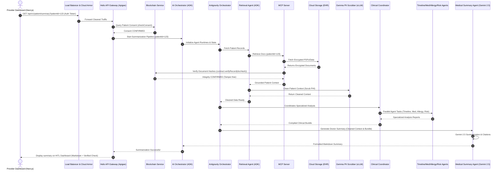

# Product Requirements Document (PRD): Helio AI

## Project: Helio AI
**Domain:** Decentralized AI-Driven Electronic Health Records (EHR) & Clinical Assistant Platform  
**Author:** Senior Product Manager, Google  
**Date:** August 7, 2026  
**Status:** Draft / Review Ready  

---

## 1. Executive Summary
Helio AI is a decentralized, agentic clinical intelligence platform designed to eliminate medical data fragmentation and reduce clinician burnout. By combining a blockchain-backed Electronic Health Record (EHR) integrity layer with Google’s Agent Development Kit (ADK), the **Antigravity Framework**, and Gemini 2.5, Helio AI enables secure, patient-consented retrieval and summarization of medical histories. 

The platform ensures that patients retain absolute ownership of their data while providing healthcare professionals with "doctor-ready" clinical summaries, scrubbed of PII via a local **Gemma PII Scrubber (vLLM)**, coordinated by a **Clinical Coordinator Swarm**, and presented in a **Human-In-The-Loop (HITL) Dashboard** that enables doctors to review, edit, and verify clinical claims in real-time.

---

## 2. Problem Statement
Modern healthcare suffers from three compounding crises:
1. **Data Fragmentation & Physician Burnout:** Patient records are siloed across disparate legacy systems (Epic, Cerner). Clinicians spend over two hours navigating these systems for every hour of clinical care, leading to cognitive overload and diagnostic errors.
2. **Trust, Consent & Record Tampering Risks:** Patient consent registries are administrative and difficult to audit. Furthermore, centralized electronic databases lack cryptographically anchored integrity, meaning a document modified post-signature (e.g. altering allergy records) goes undetected by standard systems.
3. **PII and Data Privacy Leaks:** Sending raw protected health information (PHI) to large public LLMs violates strict data privacy guidelines. Summarizers must strip personal identifiers locally before running summarization queries.

---

## 3. Goals & Objectives
*   **Objective 1: Summarization Latency.** Reduce the average time a clinician spends synthesizing a patient's multi-source medical history from 15 minutes to **under 3 seconds** (p95 latency) using stream-based responses.
*   **Objective 2: Document Integrity.** Achieve **100% automated verification** of accessed records against cryptographic hashes registered on a private blockchain consortium network.
*   **Objective 3: Accuracy & Groundedness.** Maintain a **$\ge 99\%$ Grounded Accuracy Rating** for generated summaries, ensuring zero hallucinations of critical allergies, diagnoses, or medications.
*   **Objective 4: PII Scrubbing Compliance.** Ensure **100% of local patient charts** are scrubbed of personal identifiers using local Gemma models before external summarization queries are processed.

---

## 4. Target Users & Detailed Personas

### 4.1 Dr. Evelyn Harper (Provider Persona)
*   **Role:** Chief Oncologist & Senior Clinician.
*   **Context:** Sees 20+ complex patients daily. Many patients arrive with external records, physical PDFs, or disjointed portal printouts.
*   **Pain Points:** Information overload; spends 2-3 hours every evening reviewing unstructured records. Fears missing critical drug-to-drug interactions due to data gaps.
*   **Needs:** A unified timeline view summarizing patient history, with the ability to review, edit, and provide feedback on AI-generated summaries via a HITL dashboard.

### 4.2 Julian Vance (Patient Persona)
*   **Role:** Patient with Complex Autoimmune Conditions.
*   **Context:** Constantly shares records between clinics and signing paper consent releases.
*   **Pain Points:** Total lack of visibility into who is accessing his records. Tired of requesting files from one clinic to manually send to another.
*   **Needs:** A simple mobile dashboard to grant or revoke temporal access to specific providers and audit system accesses.

### 4.3 Melissa Chen (Compliance & Security Persona)
*   **Role:** Chief Information Security Officer (CISO).
*   **Context:** Responsible for protecting patient PHI and ensuring audit preparedness.
*   **Pain Points:** High operational cost of manual security audits. Difficulty ensuring that vendor AI systems do not retain protected health information (PHI) in base models.
*   **Needs:** Cryptographic validation of consent for every query, and local PII scrubbing before records leave the secure perimeter.

---

## 5. Use Cases & User Stories

### 5.1 Use Case 1: AI-Powered Record Retrieval & Summarization
*   **Actors:** Dr. Evelyn Harper (Provider), AI Orchestrator, Antigravity Orchestrator, Retrieval Agent, MCP Server, Gemma PII Scrubber, Clinical Coordinator, Specialized Agent Swarm, Medical Summary Agent.
*   **Pre-conditions:** Dr. Harper is authenticated. Julian Vance has active records in Cloud Storage (EHR).
*   **Basic Flow:**
    1. Dr. Harper requests a clinical summary on the Provider Dashboard.
    2. Edge load balancers route the request through Cloud Armor and the Apigee Gateway.
    3. Apigee Gateway checks patient consent on the Blockchain registry.
    4. The AI Orchestrator triggers the Antigravity Orchestrator to manage agent runtimes.
    5. The Retrieval Agent fetches records via the MCP Server.
    6. The MCP Server retrieves encrypted EHR documents from GCS and queries the Blockchain to verify their cryptographic hashes.
    7. The Gemma PII Scrubber processes the retrieved documents using local vLLM instances to scrub personal identifiers.
    8. The Clinical Coordinator invokes the specialized planning swarm (**Timeline Agent, Medication Agent, Allergy Agent, Risk Agent**) to generate analysis reports.
    9. The Medical Summary Agent uses Gemini 2.5 to compile the final cited summary from the reports and cleaned documents.
    10. The summary is displayed on the HITL Dashboard, allowing Dr. Harper to verify, edit, and save it.
*   **Post-conditions:** Dr. Harper reviews the summary. An audit log is written to BigQuery.

---

## 6. Functional Requirements

| ID | Component | Feature Name | Description | Priority |
|---|---|---|---|---|
| **FR-1** | Identity | Google Cloud Identity Login | Secure SSO for Providers (via Next.js Dashboard) and Patients (via React Native App). | P0 |
| **FR-2** | Identity | Consent Registration | Patient App writes consent rule hashes directly to the Blockchain. | P0 |
| **FR-3** | Edge Security | Cloud Armor & Apigee | Cloud Armor WAF intercepts queries; Apigee Gateway validates consent rules on-chain. | P0 |
| **FR-4** | Agent Swarm | Antigravity Orchestrator | Coordinates the collaborative agent runtimes and maintains state across agent swarms. | P0 |
| **FR-5** | Agent Swarm | MCP Server Data Fetch | Fetch document blobs from Cloud Storage (EHR) using the Model Context Protocol. | P0 |
| **FR-6** | Agent Swarm | Gemma PII Scrubber | Runs local Gemma models on vLLM to scrub personal identifiers before summarization. | P0 |
| **FR-7** | Agent Swarm | Clinical Coordinator Swarm | Coordinated planning swarm running specialized agents (Allergy, Medication, Timeline, Risk) via the Antigravity Framework. | P0 |
| **FR-8** | Agent Swarm | Grounded Summarization | Medical Summary Agent reads vector passages and coordinator reports to generate cited summaries. | P0 |
| **FR-9** | Data/Retrieval | Integrity Verification | MCP Server compares the hash of retrieved documents against the blockchain registry. | P0 |
| **FR-10** | HITL Interface | HITL Dashboard Editor | Interface for doctors to review, edit, and submit feedback on AI summaries. | P1 |
| **FR-11** | Analytics | BigQuery Audit Logs | Every orchestration request, consent validation, and AI summary event must write a non-repudiation log entry to BigQuery. | P1 |

---

## 7. Non-Functional Requirements
*   **Performance:** End-to-end clinical summarization latency must be $< 3.0\text{s}$ (p95) using stream-based responses.
*   **Scalability:** Serverless architecture deployed on Google Cloud Run to auto-scale dynamically from 0 to 100+ instances.
*   **Security & Compliance:** HIPAA, GDPR, and SOC2 compliance. All PHI stored in GCS must be encrypted at rest using Customer-Managed Encryption Keys (CMEK) and TLS 1.3 in transit.
*   **Reliability:** Multi-endpoint blockchain RPC configuration configured in Web3.js to ensure 99.9% availability of the integrity layer.
*   **Data Privacy:** Zero-knowledge principles for blockchain; only anonymized hashes and metadata are stored on-chain to protect patient identity.

---

## 8. System Architecture Overview
The system follows a multi-tier, microservices-based agentic architecture:
1.  **Frontend Layer:** React Native (Patient Mobile App) for consent management, Next.js (Provider Dashboard) for clinical views, and Next.js HITL Dashboard for summaries review and feedback editing.
2.  **Gateway & Security Layer:** Global Load Balancer, Cloud Armor WAF, and Apigee API Gateway to manage routing, rate limiting, and consent validation.
3.  **Agent Swarm Layer (Google ADK & Antigravity Framework):** A modular group of specialized agents coordinated by the Antigravity Orchestrator, incorporating the Gemma PII Scrubber, and the Clinical Coordinator Swarm (Timeline, Medication, Allergy, Risk agents) running on Cloud Run.
4.  **Data & Integrity Layer:** Cloud Storage (encrypted EHR files), Vertex AI Vector Search (semantic indexing), BigQuery (audit logs), Cloud SQL (PostgreSQL metadata), and the Blockchain Service (Ethereum consortium consensus for immutable tracking).

---

## 9. API Interaction Overview

Below is the orchestration sequence showing how the Patient App, Provider Dashboard, API Gateway, Agent Swarm, Databases, and Blockchain interact.



### Key Smart Contract Functions (Solidity Interface)
```solidity
pragma solidity ^0.8.20;

contract HelioIntegrityRegistry {
    struct MedicalRecord {
        bytes32 docHash;
        uint256 timestamp;
        bool isVerified;
    }

    // Mapping: Patient Address/ID => Document ID => Record Metadata
    mapping(string => mapping(string => MedicalRecord)) private records;
    // Mapping: Patient Address/ID => Provider Address => Is Consented
    mapping(string => mapping(address => bool)) private consentRegistry;

    event RecordRegistered(string patientId, string docId, bytes32 docHash);
    event ConsentUpdated(string patientId, address provider, bool allowed);

    function registerRecordHash(string memory patientId, string memory docId, bytes32 docHash) public {
        records[patientId][docId] = MedicalRecord(docHash, block.timestamp, true);
        emit RecordRegistered(patientId, docId, docHash);
    }

    function verifyRecord(string memory patientId, string memory docId, bytes32 docHash) public view returns (bool) {
        return (records[patientId][docId].isVerified && records[patientId][docId].docHash == docHash);
    }

    function updateConsent(string memory patientId, address provider, bool allowed) public {
        consentRegistry[patientId][provider] = allowed;
        emit ConsentUpdated(patientId, provider, allowed);
    }

    function checkConsent(string memory patientId, address provider) public view returns (bool) {
        return consentRegistry[patientId][provider];
    }
}
```