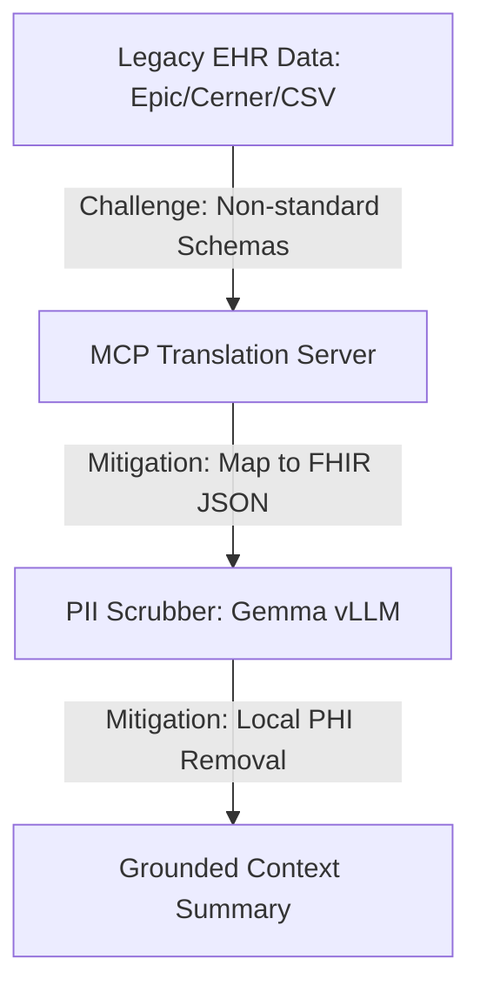

# Feasibility Study & Business Case: Helio AI

## Project: Helio AI
**Roles:** Lead Technical Consultant & Business Analyst  
**Date:** August 7, 2026  
**Target Audience:** Board of Directors, Healthcare CIOs, Venture Investors  

---

## 1. Executive Summary & Market Validation

### 1.1 Executive Summary
Helio AI is a decentralized, agentic clinical intelligence platform designed to aggregate fragmented medical records and generate grounded clinical summaries in real-time. This feasibility study evaluates the platform's Technical, Economic, Legal, Operational, and Schedule (TELOS) viability. Based on our calculations, a pilot implementation involving **3 hospital facilities and 150 clinicians** yields an estimated annual administrative value of **$14.85 Million** against a Year 1 cost (CapEx + OpEx) of **$598,000**, delivering a break-even timeline of under 15 days post-launch.

### 1.2 Market Validation Insights
*   **Clinician Burnout Crisis:** Recent studies indicate that 62% of oncologists and primary care physicians report symptoms of burnout. Administrative burdens (specifically EHR navigation) are cited as the primary cause.
*   **Interoperability Mandates:** The US 21st Century Cures Act and India’s National Digital Health Mission (NDHM) legally mandate seamless patient data access, meaning hospitals must implement APIs that allow platforms like Helio AI to programmatically request records.
*   **Growth of Agentic AI & RAG:** Hospital CIOs are actively moving away from raw LLM prompts to Retrieval-Augmented Generation (RAG) structures with strict verification layers (such as blockchain-registered file hashes and local PII scrubbing) to guarantee clinical safety.

---

## 2. Technical Feasibility (T)

### 2.1 Technology Stack Viability
The architecture proposed in [Helio architecture (3.png)](file:///d:/projects/Helio/doc/Helio%20architecture%20(3).png) represents a robust and scalable stack utilizing enterprise cloud and AI patterns:
*   **Google ADK & Antigravity Framework:** Establishes the agent runtime environment, enabling the AI Orchestrator to coordinate the specialized agents (Timeline, Medication, Allergy, Risk) via a Clinical Coordinator.
*   **Gemma PII Scrubber (vLLM):** Runs lightweight open models (Gemma 2 9B/27B) locally on GPU-enabled Cloud Run containers, ensuring personal patient identifiers are stripped before external RAG queries are processed.
*   **Model Context Protocol (MCP) Server:** Standardizes integration with legacy SQL databases, local file shares, and GCS, avoiding custom middleware configurations for every new hospital group.
*   **Vertex AI Vector Search & Embeddings:** Provides scalable, low-latency ($<50\text{ms}$) context indexing.
*   **Solidity & Hyperledger Besu:** Runs a private Proof-of-Authority (PoA) ledger on Google Cloud, delivering zero gas fees and sub-second block validation.

### 2.2 Integration Challenges & Mitigation Strategies

*   **Integration Challenge 1: EHR Fragmentation & Schema Mismatches.** Hospital EHRs use custom relational structures.
    *   *Mitigation:* The MCP Server acts as an translation layer. It retrieves native documents, converts them to HL7 FHIR JSON format, and generates standardized text embeddings.
*   **Integration Challenge 2: PII Data Privacy.** Medical files contain PHI which cannot leave the secure hospital network.
    *   *Mitigation:* Deploy the local Gemma PII Scrubber inside the hospital's private GCP VPC. The scrubber masks personal identifiers (names, IDs, addresses) prior to summarization.

---

## 3. Economic Feasibility (E)

### 3.1 Cost Estimation (Pilot Deployment: 3 Hospitals, 150 Clinicians)
We categorize costs into initial capital expenditure (CapEx) and monthly operational expenditure (OpEx) for a 12-month pilot runtime.

#### Table 1: Initial Development Capital Expenditures (CapEx)
| Phase / Resource | Role / Purpose | Duration | Estimated Cost (USD) |
|---|---|---|---|
| **Lead Blockchain Developer** | Smart contract development, RPC setup, audit | 6 months | $110,000 |
| **Full Stack Engineer** | Next.js Dashboard, React Native App integration | 6 months | $95,000 |
| **AI/ML Infrastructure Engineer** | Vertex AI pipeline, Gemini ADK agents, MCP, vLLM | 6 months | $105,000 |
| **Product Manager & QA** | Requirements, testing, hospital security audit | 6 months | $70,000 |
| **Security Auditing & Penetration Test** | Third-party smart contract & HIPAA audit | One-off | $20,000 |
| **TOTAL CAPEX** | | | **$400,000** |

#### Table 2: Projected Monthly Operational Expenditures (OpEx)
| GCP / Network Service | Estimated Capacity / Consumption | Monthly Cost (USD) | Annual Cost (USD) |
|---|---|---|---|
| **Global Load Balancer & Cloud Armor**| Edge caching, WAF, and DDoS shield | $600 | $7,200 |
| **Apigee API Gateway** | 100,000 API requests/month | $500 | $6,000 |
| **Google Cloud Run (CPUs)** | 8 agent microservices, auto-scaling | $2,200 | $26,400 |
| **Gemma PII Scrubber (vLLM GPU)** | NVIDIA L4 GPU instance on Cloud Run | $3,500 | $42,000 |
| **Cloud Storage (EHR) & SQL** | 2 TB encrypted medical data + PostgreSQL | $1,000 | $12,000 |
| **Vertex AI Vector Search** | Embeddings queries + active index maintenance | $1,800 | $21,600 |
| **Gemini 2.5 API Tokens** | 1,500 summaries/day (~16.5M tokens/day) | $3,500 | $42,000 |
| **BigQuery (Audit Logs)** | Structured logs, query retention | $400 | $4,800 |
| **Consortium Blockchain Nodes** | 3 x GCP Compute Instances (Hyperledger Besu) | $1,000 | $12,000 |
| **Ongoing Maintenance** | DevOps, security updates, bug fixes | $2,000 | $24,000 |
| **TOTAL OPEX** | | **$16,500** | **$198,000** |

---

### 3.2 Return on Investment (ROI) Analysis

#### Financial Value Assumption
*   **Time Saved per Patient:** 12 minutes (down from 15 mins to 3 mins chart review).
*   **Clinician Labor Value:** Average hourly rate of a senior specialist is **$150/hour**.
*   **Annual Savings per Clinician (15 patients/day, 220 days):** **$99,000/year**.
*   **Total Annual Hospital Group Savings (150 Clinicians):** **$14,850,000/year**.

#### Financial Performance Metrics (Year 1)
*   **Year 1 Total Cost:**
    $$\text{CapEx} \ ( \$400,000 ) + \text{OpEx} \ ( \$198,000 ) = \$598,000$$
*   **Year 1 Net Benefit:**
    $$\text{Annual Savings} \ ( \$14,850,000 ) - \text{Year 1 Cost} \ ( \$598,000 ) = \$14,252,000$$
*   **Return on Investment (ROI):**
    $$\text{ROI} = \frac{\text{Net Benefit}}{\text{Total Cost}} \times 100 = \frac{\$14,252,000}{\$598,000} \times 100 = 2,383.2\%$$
*   **Break-Even Timeline:**
    $$\text{Break-Even} = \frac{\text{Year 1 Cost}}{\text{Annual Savings}} \times 12\text{ months} = \frac{\$598,000}{\$14,850,000} \times 12 = 0.48\text{ months} \quad (\approx 14\text{ days of pilot operation})$$

---

## 4. Legal & Compliance Feasibility (L)

### 4.1 United States: HIPAA Compliance
*   All EHR files are stored in Google Cloud Storage using Customer-Managed Encryption Keys (CMEK) and decrypted locally.
*   Gemma PII Scrubber runs locally on vLLM to strip all HIPAA Safe Harbor identifiers (name, geographic data, specific dates, social security numbers) before the clinical data is sent to the summarization agent.

### 4.2 European Union: GDPR Compliance
*   **GDPR Article 17 ("Right to be Forgotten"):** Helio AI writes **only cryptographic hashes and consent metadata** to the blockchain. No raw patient names or medical histories are recorded on-chain. If a patient requests data deletion, the actual EHR records are wiped from GCS, keeping the system compliant.

### 4.3 India: Digital Personal Data Protection (DPDP) Act, 2023
*   The Patient App acts as a registered Consent Manager interface, allowing Indian citizens to dynamically update their consent rules. Data localization requirements are met by hosting the GCP stack entirely within the Mumbai (`asia-south1`) or Delhi (`asia-south2`) regions.

---

## 5. Operational Feasibility (O)

### 5.1 Hospital IT Buy-In
*   By standardizing on the **Model Context Protocol (MCP)**, hospital IT departments do not need to open inbound network ports. They deploy a local, read-only MCP agent inside their internal network that queries the database locally and pushes encrypted outputs outward over outbound-only TLS 1.3 connections.

### 5.2 Provider Adoption and HITL Verification
*   The Next.js Provider Dashboard and the HITL Dashboard are designed to be embedded directly within legacy EHR frames (e.g., Epic App Orchard) using standard iframe APIs. Clinicians can review, edit, and verify the AI summaries directly in their existing screens.

---

## 6. Schedule Feasibility (S)
The schedule is designed to reach an operational pilot state in **16 weeks**, followed by a **12-week clinical audit and trial phase**.
*   **Weeks 1–4 (Phase 1: Foundation):** Deploy private Besu consortium nodes on GCP and Solidity smart contracts.
*   **Weeks 5–8 (Phase 2: Local Interoperability):** Write local MCP servers and FHIR mappings.
*   **Weeks 9–12 (Phase 3: Agentic Swarm & PII Scrubber):** Deploy the Gemma PII Scrubber (vLLM) and coordinate the specialized agents (Timeline, Medication, Allergy, Risk) via the Antigravity Framework.
*   **Weeks 13–16 (Phase 4: UI Integration & HITL):** Launch Patient App, Provider Dashboard, and HITL dashboard editor.
*   **Weeks 17–28 (Pilot & Evaluation):** Run the 12-week pilot with 150 clinicians.

---

## 7. Risk Analysis & Mitigation
*   **Risk: AI Hallucinations.** The summary agent might misrepresent clinical parameters.
    *   *Mitigation:* Implement strict schema boundaries on Gemini 2.5 and run a secondary, automated validation pass. Every claim must contain page-level citations to source records.
*   **Risk: HIPAA Compliance Violations.** Raw PHI leakages to external systems.
    *   *Mitigation:* Run the Gemma PII Scrubber locally inside the hospital network boundary, scrubbing 100% of PHI before summarization.

---

## 8. SWOT Analysis

| **STRENGTHS** | **WEAKNESSES** |
|---|---|
| * **Multi-Agent Efficiency:** Grounded RAG with Google ADK and Antigravity Framework reduces review times by 80%. | * **System Complexity:** Managing blockchain networks and multi-agent swarms increases architecture overhead. |
| * **Local PII Scrubbing:** Gemma on vLLM provides HIPAA-compliant data scrubbing. | * **Dependency on Hospital Cooperation:** Relies on hospital IT teams installing MCP connector scripts. |
| * **Human-In-The-Loop (HITL) Validation:** Ensures doctors remain final validators of AI outputs. | * **High GPU Costs:** Running local vLLM instances increases cloud operational expenditures. |
| **OPPORTUNITIES** | **THREATS** |
| * **Global Healthcare Mandates:** 21st Century Cures Act (US) and NDHM (India) legally push for interoperability. | * **Stiff Competition:** Large EHR providers (Epic, Oracle/Cerner) are launching internal AI tools. |
| * **B2B Licensing Scale:** Once proven in a pilot, Helio AI can be licensed as an enterprise B2B SaaS model. | * **Consensus Latency:** Scaling up consortium nodes too quickly could trigger network synchronization delays. |
